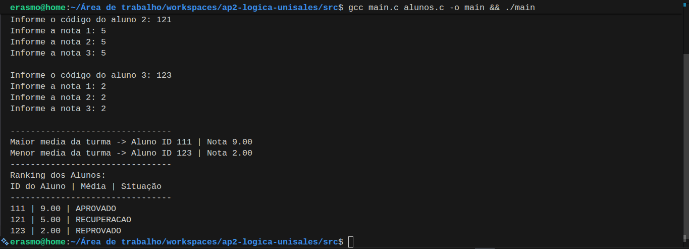

# 🚀 Rankeador de Média dos Alunos


Projeto desenvolvido como Avaliação de Produto 2 da disciplina Lógica Digital na Resolução de Problemas, oferecida no 1º período do curso de Sistemas de Informação.

## 🎯 Objetivo

O programa solicita uma quantidade N de alunos, o código identificador e três notas de cada aluno. Após o processamento dos dados, o sistema retorna um relatório completo detalhando o desempenho da turma, aplicando os conceitos de lógica de programação estruturada.

## 📝 Descrição

Este repositório contém um programa escrito em C para gerenciar e processar notas escolares. A arquitetura do código foi pensada de forma modular, separando as regras de negócio em um módulo específico de alunos (`alunos.c` e `alunos.h`) e mantendo a execução no arquivo principal (`main.c`), garantindo um código limpo e organizado.

## ✨ Funcionalidades

O sistema é capaz de realizar as seguintes operações:
- Leitura de um número N de alunos.
- Coleta do código identificador e 3 notas por aluno.
- Cálculo automático da **média aritmética** de cada indivíduo.
- Definição da **situação acadêmica**: Aprovado, Recuperação ou Reprovado.
- Identificação da **Maior** e **Menor** média geral da turma.
- Exibição de um **Ranking Final**, ordenando os alunos da maior para a menor nota.

## 📸 Demonstração


## 💻 Tecnologias Utilizadas

- Linguagem C
- Estruturas de Dados Básicas e Modularização
- VsCode

## 🏗️ Estrutura do Projeto

- `src/`
  - `alunos.c` - Implementação das funções de manipulação de alunos.
  - `alunos.h` - Declarações das funções e estruturas utilizadas pelo módulo de alunos.
  - `main.c` - Programa principal para compilar e executar o sistema.
  - `main` - Executável gerado após a compilação (não é parte do código-fonte).

## ✅ Requisitos

- GCC ou outro compilador compatível com a linguagem C.
- Uma IDE ou editor de texto de sua preferência (como Code::Blocks ou VS Code).

## ▶️ Como compilar e executar o programa

Abra o terminal, navegue até o diretório `src` e execute o comando abaixo para compilar o código fonte e gerar o executável:

```bash
gcc main.c alunos.c -o main
```

## 👥 Equipe

| Nome | LinkedIn | GitHub | E-mail |
| :--- | :--- | :--- | :--- |
| Andrew Minto Neves | [LinkedIn](Link) | [GitHub](Link) | a.mintoneves@gmail.com |
| Eividy Silva de Oliveira | [LinkedIn](Link) | [GitHub](Link) | eividy.oliveira@souunisales.com.br |
| Erasmo Ribeiro Bezerra | [LinkedIn](https://www.linkedin.com/in/erasmobezerra/) | [GitHub](https://github.com/erasmobezerra) | erasmo.ads.tech@gmail.com |
| Gabriel de Jesus Santana Serri | [LinkedIn](Link) | [GitHub](Link) | gabriel.jesus@souunisales.com.br |
| ayk Vilar do Bomfim Calmon | [LinkedIn](Link) | [GitHub](Link) | ayk.calmon@souunisales.com.br |

